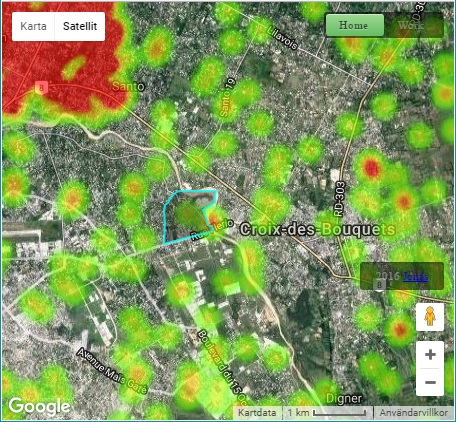

# 2andfro

A tool for visualizing many A/B coordinates. Can be used for large volumes of anonymized
home/work locations. The output visualization is overlayed on Google Maps, and using
a mouse you can circle the home area which you wish to know distribution of work locations
in. The inverse is also possible by flipping the home/work switch in the upper-right corner.

# 

Go [here](http://pixeldoctrine.com/2andfro/) for a demo.

To be able to visualize and further anonymize the location data, it is pre-processed in the
backend using a fast space partitioning algorithm. Input A/B geographic coordinate data
comes from a CSV file in the following form:

```
,,,Location_A,Location_B
0,0,0.0,"(18.539460420153144, -72.21091477473468)","(18.597036616735966, -72.30647840071002)"
1,1,1.0,"(18.605740256111606, -72.18535983103509)","(18.578576447251983, -72.17140597601646)"
2,2,2.0,"(18.637699128605984, -72.3045760946615)","(18.580339416785346, -72.18853942056946)"
3,3,3.0,"(18.606411007766205, -72.21514501950796)","(18.532748207420216, -72.27137725342389)"
```

All close-by A and B coordinates are chunked together with minimum N users per chunk, and
output as two separate JSON files. The two JSON files are read by the 2andfro.js during page
load.

The code size is pretty small and should be fairly easy to grasp. Back-end partitioning is 81
lines of Python code, front-end JavaScript which handles loading and mouse circling is 144
lines of code. HTML 35 lines, CSS 84.
